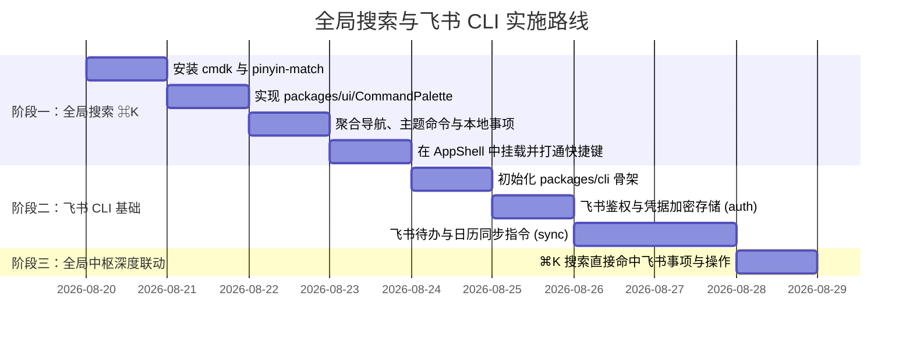

# 全局搜索（Command Palette ⌘K）与飞书 CLI 集成设计规范

日期：2026-08-20  
状态：设计已制定，待确认  
涉及模块：`packages/ui`、`packages/web`、`packages/core`、`packages/cli`（新建）、`modules/workbench`

---

## 1. 背景与目标

### 1.1 全局搜索（Command Palette ⌘K）

工作台顶部已预留了全局搜索入口（`⌘K` 按钮），当前需要一套轻量、快速、贴合本地优先（Local-first）体验的全局中枢：

1. **全局快捷唤起**：支持 `⌘K` / `Ctrl+K` 全局快捷键与顶栏点击唤起。
2. **三维立体检索**：
   - **快捷动作与命令**：切换深色模式、切换主题配色、偏好设置、多账号切换等。
   - **页面快速导航**：直达今日待办、周日历、秋招投递、秋招统计、关于等页面。
   - **数据与领域实体**：检索所有模块的事项（`core.items`，如待办事项、面试日程）及专有实体（秋招公司名、岗位、轮次等）。
3. **极速拼音模糊检索**：采用开源成熟生态 `cmdk` 作为交互基座，结合 `pinyin-match` 实现中文全拼、拼音首字母（如 `tx` → `腾讯`，`db` → `待办`）与中英混合检索。
4. **恪守三条铁律**：模块之间零依赖，Core 不感知具体模块。全局搜索通过标准能力槽与注册表读取，新增第 10 个模块时全局搜索无需重构。

### 1.2 飞书 CLI（Feishu / Lark CLI）需求

飞书是高频个人与职场协同平台，涵盖**飞书待办（Tasks）**、**飞书日历（Calendar）**、**多维表格（Bitable）**与**机器人通知（Bot/Webhook）**。
需要为工作台引入轻量 CLI 工具链（`@workbench/cli`），实现飞书与个人工作台的打通：

1. **凭据安全管理**：支持自建应用（App ID + App Secret）或 User Access Token 鉴权，复用 ADR-0021 的安全加密凭据存储机制。
2. **数据同步与拉取**：
   - `sync-tasks`：拉取飞书待办/任务，映射为本地工作台事项。
   - `sync-calendar`：拉取飞书日程并投影至工作台日历视图。
   - `sync-bitable`：拉取飞书多维表格（如招聘投递表）并导入秋招模块。
3. **终端极速录入**：支持 `pwb add "下午3点技术面" --time "15:00"` 快捷创建并可同步至飞书。
4. **与全局搜索联动**：通过 ⌘K 可直接搜索出同步自飞书的事项（带飞书专属 Badge），并支持一键打开飞书网页端对应卡片。

---

## 2. 全局搜索技术架构设计

### 2.1 技术选型

- **UI 交互基座**：`cmdk`（Headless、高性能键盘导航、无障碍支持、shadcn/Linear 标杆）
- **中文拼音检索**：`pinyin-match`（30KB 超轻量、支持多音字、全拼、首字母缩写、返回命中区间用于高亮）
- **样式体系**：Tailwind CSS（基于项目现有设计变量：`bg-surface`、`text-ink`、`bg-accent`、`border-line`）

### 2.2 搜索项数据结构（Unified Search Item Contract）

在 `packages/ui` 中定义标准搜索结果类型：

```ts
export type CommandCategory = 'command' | 'navigation' | 'item' | 'domain';

export interface CommandItemDescriptor {
  id: string;
  category: CommandCategory;
  /** 用于展示的标题 */
  title: string;
  /** 副标题或额外描述（如 "秋招模块 · 技术面"、"系统设置"） */
  subtitle?: string;
  /** 参与检索的额外关键词（包含英文、别名等） */
  keywords?: string[];
  /** 徽标列表，如 ['今日', 'S级', '飞书'] */
  badges?: string[];
  /** 图标组件 */
  icon?: React.ReactNode;
  /** 快捷键提示（如 "⌘,"） */
  shortcut?: string;
  /** 选中后的行为 */
  onSelect: () => void | Promise<void>;
}
```

### 2.3 拼音匹配与评分过滤逻辑

`cmdk` 提供自定义 `filter` 钩子，我们通过 `pinyin-match` 接管匹配：

```ts
import PinyinMatch from 'pinyin-match';

function customCommandFilter(value: string, search: string, keywords?: string[]): number {
  if (!search.trim()) return 1;
  const query = search.trim();

  // 1. 原生字符串包含（忽略大小写）
  if (value.toLowerCase().includes(query.toLowerCase())) return 1;

  // 2. 关键词包含
  if (keywords?.some((k) => k.toLowerCase().includes(query.toLowerCase()))) return 1;

  // 3. 中文拼音匹配（全拼、首字母）
  const matchResult = PinyinMatch.match(value, query);
  if (matchResult) return 1;

  return 0;
}
```

### 2.4 弹窗组件设计（`packages/ui/src/CommandPalette.tsx`）

- **触发入口**：
  - 全局快捷键：`⌘K` (Mac) / `Ctrl+K` (Windows/Linux)
  - 顶栏 `AppShell` 搜索按钮点击
- **层级布局**：
  - **Header**：搜索输入框（自动聚焦，支持一键清空与 ESC 退出）
  - **Body**：
    - 分组 1：`常用命令`（切换深浅模式、切换主题、关于、备份管理）
    - 分组 2：`快速导航`（今日、日历、秋招投递、统计、偏好设置）
    - 分组 3：`事项与日程`（来自今日/待办/日历的活跃事项）
    - 分组 4：`秋招与领域数据`（公司名、岗位、轮次、飞书导入事项）
  - **Footer**：快捷键提示栏（`↑↓ 导航`、`↵ 打开`、`ESC 关闭`）

---

## 3. 飞书 CLI（Feishu / Lark CLI）需求与架构设计

### 3.1 架构定位与包组织

在 monorepo 根目录下新建 `packages/cli`：

```
packages/cli/
  package.json              (@workbench/cli, bin: { pwb: './dist/bin.js' })
  src/
    bin.ts                  命令行入口（基于 commander 或 cac）
    commands/
      feishu/
        auth.ts             飞书凭据配置与登录 (pwb feishu auth)
        syncTasks.ts        飞书待办双向/单向拉取 (pwb feishu sync-tasks)
        syncCalendar.ts     飞书日历拉取 (pwb feishu sync-calendar)
        syncBitable.ts      飞书多维表格同步 (pwb feishu sync-bitable)
      items/
        add.ts              快速创建事项 (pwb add "任务名")
        list.ts             查看今日事项 (pwb list)
    feishu/
      client.ts             飞书开放平台 OpenAPI 封装
      adapters/             飞书数据结构与 Core Item 转换器
```

### 3.2 飞书能力集成矩阵

| 功能模块                     | 对应飞书开放平台能力                                    | Workbench 映射关系                                                              |
| :--------------------------- | :------------------------------------------------------ | :------------------------------------------------------------------------------ |
| **飞书待办 (Tasks v2)**      | `task/v2/tasks`                                         | 映射为 Core `Item`（`sourceModule: 'feishu'` 或 `todo` 扩展），双向同步完成状态 |
| **飞书日历 (Calendar v4)**   | `calendar/v4/calendars/{calendar_id}/events`            | 映射为工作台 `scheduled` 日程事件，可在周日历与今日视图直观展示                 |
| **多维表格 (Bitable v1)**    | `bitable/v1/apps/{app_token}/tables/{table_id}/records` | 映射为 `campus_recruit_applications`（企业、岗位、轮次、薪资）                  |
| **机器人通知 (Bot Webhook)** | 飞书群自定义机器人 Webhook                              | 本地工作台每日早报/临期提醒推送到飞书群                                         |

### 3.3 飞书 CLI 命令规范

```bash
# 1. 飞书配置与鉴权
pwb feishu auth --app-id <cli_xxx> --app-secret <sec_xxx>
pwb feishu status     # 检查当前飞书授权状态与已连接日历/多维表格

# 2. 数据同步
pwb feishu sync-tasks               # 拉取飞书待办至工作台
pwb feishu sync-calendar --days 14  # 拉取未来 14 天飞书日程
pwb feishu sync-bitable <app_token> <table_id> # 同步招聘多维表格

# 3. 极速录入与提醒
pwb add "下午 16:00 飞书字节技术面" --due "16:00" --sync-feishu
pwb notify --daily    # 将今日待办汇总推送到飞书 Webhook
```

### 3.4 模块隔离与安全性约定

1. **凭据安全隔离**：飞书的 App Secret 绝不硬编码，保存在本地 `data/local/credentials.json` 并使用本地机器密钥做加密隔离。
2. **Core 零感知**：飞书 CLI 通过 HTTP API 或标准的 Repository 适配器操作数据，`packages/core` 不增加任何飞书专用逻辑。

---

## 4. 实施阶段规划



---

## 5. 验收标准

1. **全局搜索体验**：
   - 任何界面按下 `⌘K` / `Ctrl+K`，弹窗在 50ms 内平滑呈现，无卡顿。
   - 输入 `tx` 能即刻过滤出「腾讯」相关投递或事项；输入 `zt` 能过滤出「切换主题」命令。
   - 键盘 `↑` `↓` 移动选区丝滑，回车直接跳转对应页面或执行对应动作。
2. **飞书 CLI**：
   - 能够通过 `pwb feishu auth` 成功配置自建应用凭据。
   - 运行 `pwb feishu sync-tasks` 可将飞书待办正确抓取并落库至本地工作台。
